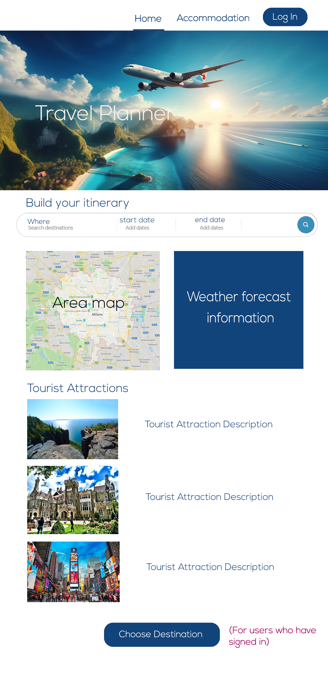
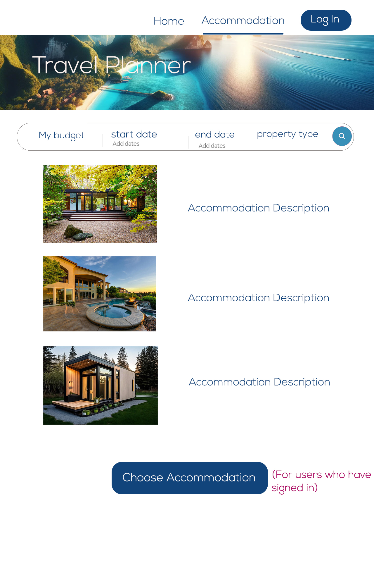
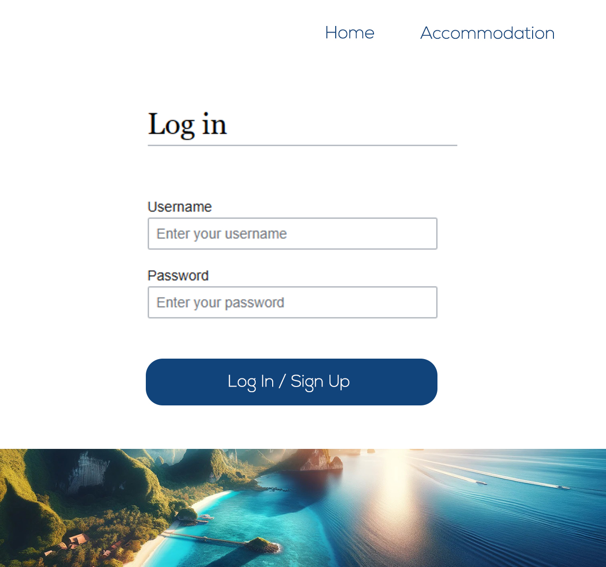

# Project Title
Travel Planner Website
## Overview

Travel Planner is a website designed to simplify the trip planning process. It enables users to gather information and create personalized travel itineraries.

### Problem

The complexity of trip planning often overwhelms travelers due to the need to visit multiple sites for information on destinations, accommodations, and activities. Travel Planner addresses this issue by offering a centralized platform for all travel planning needs, reducing time spent on research and planning.

### User Profile

Travelers (from solo adventurers to families and groups)
-looking for a travel destination
-looking for an accommodation
-looking for attractions (i.e. restaurants, museums, art galleries, natural attractions, historical attractions)
-who want to save their itinerary and keep track of their trip plans history (a part of nice to have)

### Features

As a user I want to be able to use the following features:

- Find the destination where I want to travel to, using:

   1. a weather forecast feature
   2. information about the destination's attractions
   3. an interactive and dymanic map that shows attractions

- Choose where I want to stay (based on my budget, number of people, date, type of property)

- Find attractions/ activities
- Use an interactive dynamic map that shows destinations and allows exploration of attractions

- (Nice-to-Have) User Authentication: Users can register and log in to manage and save their travel plans.

## Implementation

### Tech Stack

- React
- JavaScript
- Node.js & Express
- Client libraries: 
    - react
    - react-router
    - axios
- Server libraries:
    - knex
    - express

### APIs

Google Maps API: For rendering maps and exploring destinations.
OpenWeather API: For accessing weather data of destinations.
Accommodation APIs: for fetching accommodation suggestions based on user inputs.

### Sitemap

- Home & Itinerary Builder Page
- Signup/Login Page
- Not Found Page
- (Nice-to-Have) Dashboard with user-specific travel plans.

### Mockups
(The current mockups are only the initial illustration and will change)

### Data

- Tourist Attraction Data: Could be stored locally or fetched from an external API.
- Weather Data: Fetched in real-time from a weather forecast API.
- Accommodation Data: Fetched from accommodation APIs based on user input.
- User: Stores profile information, encrypted passwords, and trip plans.
- Itinerary: Contains destination details, dates, and planned activities.
(These data relationships can be visualized in an Entity-Relationship Diagram or similar.)

### Endpoints
**GET /destinations/:city**

Fetches tourist attractions and weather forecast for the selected city and date.

**GET /accommodations**

Fetches accommodation suggestions based on user input.

**POST /users/login and POST /users/register**

For user registration and login

### Auth

- JWT auth

## Roadmap

- Create client (react project with routes and boilerplate pages)

- Create server
- API Integration (integrate Google Maps, weather forecast, and accommodation APIs)
- Testing and Debugging (Test the application thoroughly and fix any bugs)

## Nice-to-haves

- A user dashboard that shows all the itineraries the user have saved
- Budget Management
- Itinerary Generation Using AI
- Collaborative Planning (features for multiple users to co-plan and edit itineraries)
- Reviews and Recommendations
- Social Sharing
- Personalized destination, attraction, and accommodation suggestions

